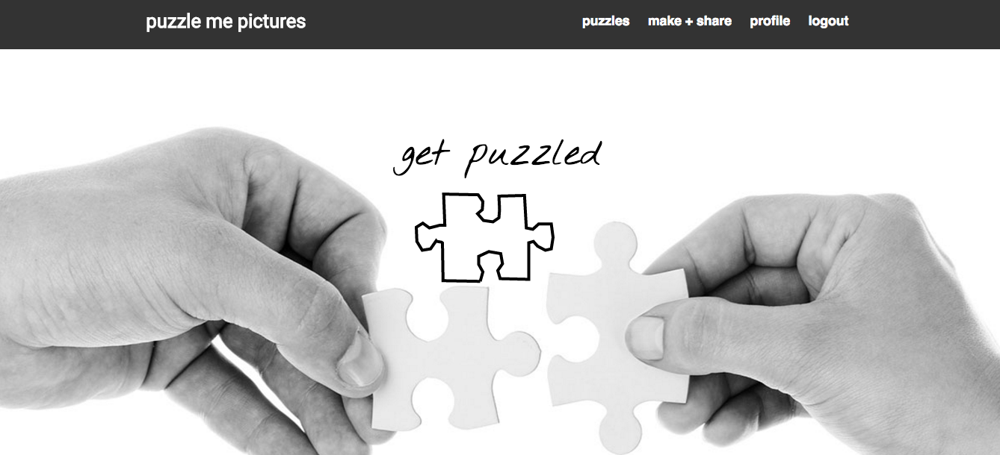

# puzzle me pictures

## Overview
puzzle me pictures is an app that allows users to upload images, convert them into puzzles, and then send their puzzles to their friends. The puzzles must be completed in order to see the images. Users can adjust the difficulty of the puzzles.

]

## Technologies Used
* [Ruby on Rails](http://rubyonrails.org/): web application framework used for the app
* [Devise](https://github.com/plataformatec/devise): user authentication
* HTML5 Canvas & JavaScript: ability to create puzzles and drag and drop functionality to piece together shuffled puzzles
* [CarrierWave](https://github.com/carrierwaveuploader/carrierwave): gem for file uploads
* [RMagick](https://rmagick.github.io/) and [MiniMagick](https://github.com/minimagick/minimagick): for resizing image uploads
* [File Validators](https://github.com/musaffa/file_validators): gem for validating file size
* [Heroku](http://www.heroku.com/): hosting the deployed app

## Approach
After completing a hangman app and a drawing app, I noticed a common thread in the work that I'm passionate about - and that's building interactive web applications. In all cases, it just so happens that the interactivity is added with HTML5 Canvas.

That being said, I knew that the third interactive app that I wanted to build had to incorporate puzzles somehow.

I started off trying to build the application a couple of different ways in React. I kept running into issues with the canvas element, so given the week timeline for the project, I decided to turn back to Rails to see how I could really fine-tune the application.

## Planning
### Entity Relationship Diagram (ERD)

### Wireframes
[Check out the wireframes](planning/wireframes.pdf)

### User Stories
* As a user, I want to upload an image and convert it into a puzzle.
* As a user, I want to be able to share a link to my puzzle.
* As a user, I want to be able to have friends view my puzzle, but not see the image until the puzzle is completed.

[View more User Stories](planning/user_stories.md)

## Installation
If running locally, you will need an AWS key for uploading images with CarrierWave.

To run locally:

- `bundle install` to install dependencies
- `bundle e rails db:setup` to setup the database
- `bundle e rails db:migrate` if there are any pending migrations
- `brew services start postgresql`
- `bundle e rails s` to start the server locally

## Unsolved Problems/Next Steps
* Find a different way to upload and store images for free (an AWS replacement)
* Make the puzzle pieces jigsaw-shaped instead of rectangles
* Add the ability to favorite puzzles and add view that shows a user's favorites
* Add view where user can see all the puzzles that they've created
* Ability for users to exclude puzzles from the main layout view
* Make puzzle functionality mobile-friendly
* On completing a puzzle, add button that automatically downloads the image for the user
