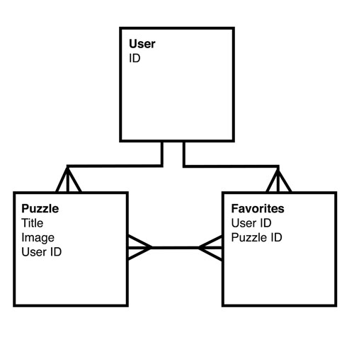

# puzzle me pictures

## Overview
puzzle me pictures is an app that allows users to upload images, convert them into puzzles, and then send their puzzles to their friends. The puzzles must be completed in order to see the images. Users can adjust the difficulty of the puzzles.

## Technologies Used
* HTML5 Canvas & JavaScript

## Approach
After completing a hangman app and a drawing app, I noticed a common thread in the work that I'm passionate about - and that's building interactive web applications. In all cases, it just so happens that the interactivity is added with HTML5 Canvas.

That being said, I knew that the third interactive app that I wanted to build had to incorporate puzzles somehow.

## Planning
### Entity Relationship Diagram (ERD)

### Wireframes
[Check out the wireframes](planning/wireframes.pdf)

### User Stories
* As a user, I want to upload an image and convert it into a puzzle.
* As a user, I want to be able to share a link to my puzzle.
* As a user, I want to be able to have friends view my puzzle, but not see the image until the puzzle is completed.

[View more User Stories](planning/user_stories.md)

## Installation

## Unsolved Problems/Next Steps
* Make the puzzle pieces jigsaw-shaped instead of rectangles
